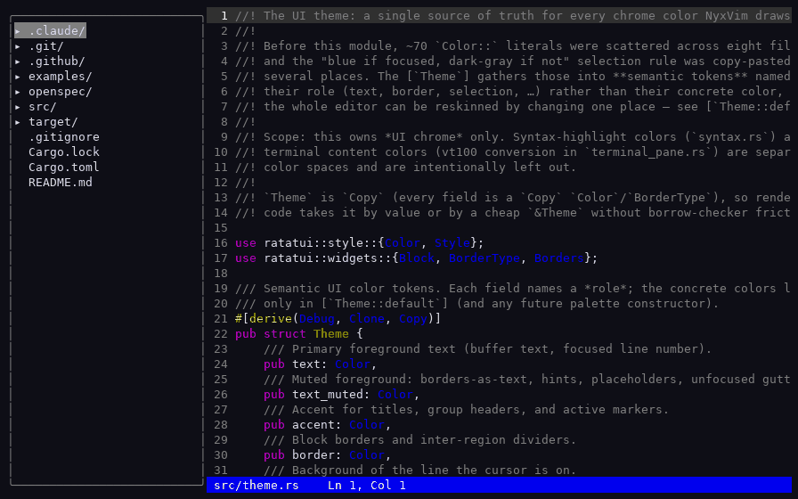

# NyxVim

[](https://github.com/Guiartuzo/NyxVim/actions/workflows/rust.yml)

A minimalist, **modeless** terminal code editor — fast and snappy like `nano`/`vim`,
but with a familiar VSCode-style editing model (arrow keys move, `Shift+Arrow`
selects, `Ctrl+S` saves). It has a toggleable file-tree sidebar, split panes, line
numbers, syntax highlighting, multiple cursors, word autocomplete, fuzzy file
finding, an integrated terminal area (multiple terminals), and a side-by-side git
diff view.



> Status: **MVP foundation.** AI integration — the long-term differentiator — is
> deliberately deferred to a future change, as are a command palette and a plugin
> system.

## Install

Prebuilt binaries for **Linux, macOS, and Windows** are published on the
[**Releases page**](https://github.com/Guiartuzo/NyxVim/releases) — download the
archive for your OS, extract, and run `nyxvim`. No toolchain required.

### Build from source

NyxVim is written in Rust. With a Rust toolchain installed (`rustup`):

```bash
# Run, opening a file:
cargo run --release -- path/to/file.rs

# Run in the current directory (empty buffer, sidebar shows the working dir):
cargo run --release

# Build a release binary at target/release/nyxvim:
cargo build --release

# Run the test suite:
cargo test
```

The sidebar is rooted at the current working directory.

## Keybindings

Modeless: you are always typing into the focused pane. Press `F1` for the same
list in-app (it is generated from one table, so it can't drift from this README).

### Global
| Key | Action |
| --- | --- |
| `Ctrl+Q` | Quit |
| `Ctrl+B` | Show / hide the file-tree sidebar |
| `Ctrl+J` | Show / hide the terminal area |
| `Ctrl+D` (or `Ctrl+Shift+G`) | Show / hide the git diff view |
| `Ctrl+K` / `Ctrl+L` / `Ctrl+O` | Focus the file tree / terminal / editor |
| `F1` | Toggle the keybinding help overlay (`Esc` to close) |

### Editor pane
| Key | Action |
| --- | --- |
| Arrows | Move the cursor |
| `Home` / `End` | Move to the start / end of the line |
| `PageUp` / `PageDown` | Move up / down by a viewport height |
| `Shift`+(movement) | Extend a selection |
| Printable keys | Insert text (replacing any selection) |
| `Enter` / `Backspace` / `Delete` | Split the line / delete (joining at boundaries) |
| `Tab` | Insert four spaces |
| `Ctrl+S` | Save |
| `Ctrl+Z` / `Ctrl+Y` | Undo / redo |
| `Ctrl+F` | Find (incremental search; `Enter` next, `Esc` cancel) |
| `Ctrl+G` | Go to line |
| `Ctrl+P` | Fuzzy file finder |
| `Ctrl+N` (or `Ctrl+Space`) | Autocomplete the current word |
| `Ctrl+E` (or `Ctrl+\`) | Split the pane vertically |
| `Ctrl+W` | Close the focused pane |
| `Alt+Left` / `Alt+Right` | Move focus between panes |

### Multiple cursors
| Key | Action |
| --- | --- |
| `Ctrl+Alt+Up` / `Down` (or `Alt+Shift+Up` / `Down`) | Add a caret above / below |
| `Esc` | Collapse back to a single caret |

### Autocomplete popup (while open)
| Key | Action |
| --- | --- |
| `Up` / `Down` | Previous / next candidate |
| `Tab` / `Enter` | Accept the selected candidate |
| `Esc` | Dismiss the popup |

### Terminal area
| Key | Action |
| --- | --- |
| `Ctrl+T` | Open a new terminal |
| `Alt+Left` / `Alt+Right` | Switch between terminals (when focused) |
| `Ctrl+W` | Close the focused terminal |

When a terminal is focused, keystrokes are forwarded to the shell (including
`Ctrl+C`). The global and pane-management chords above are intercepted by NyxVim
and do not reach the shell.

### Sidebar (file tree)
| Key | Action |
| --- | --- |
| `Up` / `Down` | Move the selection |
| `Right` / `Left` | Expand / collapse a directory |
| `Enter` | Open a file (into the focused pane) or toggle a directory |

### File finder (`Ctrl+P`)
| Key | Action |
| --- | --- |
| `Up` / `Down` | Move the selection |
| `Enter` | Open the selected file |
| `Esc` | Dismiss |

### Diff view (`Ctrl+D`)
| Key | Action |
| --- | --- |
| `Up` / `Down` | Select a file / scroll the diff |
| `Enter` / `Right` | Enter the diff (from the file list) |
| `Left` | Back to the file list |
| `n` / `p` | Jump to the next / previous change |
| `r` | Refresh against `HEAD` |
| `Esc` | Close the diff view |

## Architecture

```
main.rs          entry point: open file, set up terminal, run
app.rs           central App state + the AppEvent loop (input + PTY output)
terminal.rs      raw mode / alternate screen / panic-safe teardown
buffer.rs        ropey-backed text buffer (load, edit, save, undo/redo)
pane.rs          editor pane: cursor(s), selection, scrolling, rendering
file_tree.rs     lazily-loaded file-tree sidebar
file_find.rs     fuzzy file finder (subsequence ranking)
minibuffer.rs    one-line prompt: search, go-to-line, fuzzy-find input
complete.rs      buffer-word autocomplete popup
syntax.rs        tree-sitter syntax highlighting (per visible line)
git.rs           working-tree vs HEAD diff model
diff_view.rs     side-by-side git diff surface
terminal_area.rs docked terminal area: multiple terminals, tabs
terminal_pane.rs integrated terminal: PTY + vt100 grid + reader thread
theme.rs         centralized UI theme (one source of truth for chrome colors)
```

Buffers live in a central store on `App`; panes reference them by id. This ID
indirection keeps shared state simple (no `Rc<RefCell<>>`).

## Known limitations (MVP)

- Syntax highlighting is computed per visible line, so multi-line constructs
  (block comments, multi-line strings) aren't tracked across line boundaries.
- Tabs in files are not width-expanded for cursor placement (NyxVim inserts
  spaces for `Tab`).
- Incremental search exists (`Ctrl+F`), but there is no search-and-replace UI.
- Splits are vertical only; no editor tabs or horizontal splits.

## Development

This project is developed with [OpenSpec](https://github.com/) change proposals.
The founding MVP is specified under `openspec/changes/mvp-editor-foundation/`
(proposal, design, specs, tasks).
